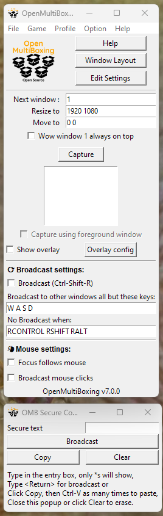

# Open MultiBoxing online HELP

_Note that this page isn't fully updated yet and is still more or less the original WowOpenBox help._

## Basic information

1. Use the "Window Layout" UI to setup your Windows automatically. And you can tweak the intelligent auto layouts by:
    + Dragging any window to reposition it
    + Resize it by dragging the orange bottom right corner
    + Toggle "Stay on top" by clicking on the text
    + Use the snap to grid feature to constraint the position
    + Use the arrow keys for precise movement by 1 pixel

1. _and/or tweak it using:_ Manual Setup (from main window):

    1. Manually select the Size you want your next window to be(*)

    1. Manually select the position you want it to be at(*)

    1. Decide if that window should stay on top of others. you can use a hotkey (default `Ctrl-Shift-T`) to toggle that setting on the fly.(*)

1. Use the Bnet launcher to start your wow windows so you don't need to type your password, OMB will make them borderless automatically for you, but check in game resolution options to avoid pixelization (100% Render Scale, Correct window size). See also the `.bat` files included in the OMB zip file for a way to start multiple games windows at once (but you'll need to enter credentials individually or through the Secure copy paste broadcasting dialog).

1. OMB since version 4.1 will automatically capture and place the windows in their respective position for you (you can turn that option off in the Option menu). Otherwise, press the "Capture" button or use its hotkey (default `Ctrl-Shift-C`). If you want to manage other games than World of Warcraft, see the ['Other Games' section below](#other-games)

1. Press a hotkey to change which window gets the keyboard input: default key are `Ctrl-F1` for Wow 1, `Ctrl-F2` for Wow 2, etc.. or rotate between windows with hotkeys to focus the next window (defaults to `Ctrl-Shift-N`) and previous window (defaults to `Ctrl-Shift-P`). Hotkeys are changeable in settings.

1. Press a hotkey to bring window N to the main (1) window: default `Ctrl-Shift-F2` will swap 1 and 2,  `Ctrl-Shift-F3` for swapping 1 and 3, etc... changeable in settings. Or rotate the swap between all windows by repeatedly pressing `Ctrl-OEM3` (OEM3 is the `~` key on us keyboards) for forward swap or `Ctrl-Shift-OEM3` for backward swap.

1. You can toggle the overlay on/off at any time using the default hotkey `Ctrl-Shift-O` or the checkbox on the main window.

1. If you used the optional key Broadcasting in the UI and can use `Ctrl-Shift-R` as the default hotkey to toggle it on/off. Enter which keys should be excluded from broadcasting in the entry box (default is all keys are broadcasted except for W S A D, see the [FAQ entry](https://github.com/WowOpenBox/WowOpenBox/wiki/FAQ#what-special-key-names-can-i-use-in-the-round-robin-key-list) for complete list of special key names).

*: You can change all settings at any time and they will be saved, per window index when you click "Update" or "Save and Apply" in the Window Layout GUI.

Your settings are saved in `OpenMultiboxingSettings.tcl` in same folder as OpenMultiBoxing and can be edited pressing the "Edit Settings" button.

Make sure to also explore the File, Option etc menus (menu bar is at the top of the window) and read mouse over tooltips present in most UI elements of OMB.

Use the clipboard copy/paster in file menu (and check the Options menu to having always open) to **broadcast** text to all your windows.

## Mouse control

You can change the focus following mouse and auto raise/set foreground and the delay

Note that to change the delay you need to hit the Return key

There is a "Track Mouse" (and stop tracking) button (and hotkey, default `Ctrl-Shift-M`) to track coordinates to help doing pixel perfect placement of your windows

You can toggle the focus follow mouse behavior using a hotkey (default `Ctrl-Shift-F`)

You can turn on Left and Right Mouse Click **broadcasting** using the checkbox or the hotkey (default `Ctrl-M`). Pressing both mouse buttons (ie movement), or leaving any button held for more than half a second (ie camera changes) or having W key held will prevent click broadcasting.

## Other Games

Use the Game menu to select your Game and/or check the Capture using foreground window:

Read the help text mouse over tooltip:

You must click your game window and use the capture hotkey (`Ctrl-Shift-C` by default, changeable in settings) to use that mode; after which your game name should be recorded in the Game menu and you can stick to normal Auto Capture (Options Menu).

## Need more help? Report a problem? Suggest a new feature?

Make sure you are running the latest [release](https://github.com/OpenMultiBoxing/OpenMultiBoxing/releases)

Check if your [issue](https://github.com/OpenMultiBoxing/OpenMultiBoxing/issues/) or suggestion has already been report and if not make a new detailed one

Check the [FAQ](https://github.com/WowOpenBox/WowOpenBox/wiki/FAQ)

Reach out on 
