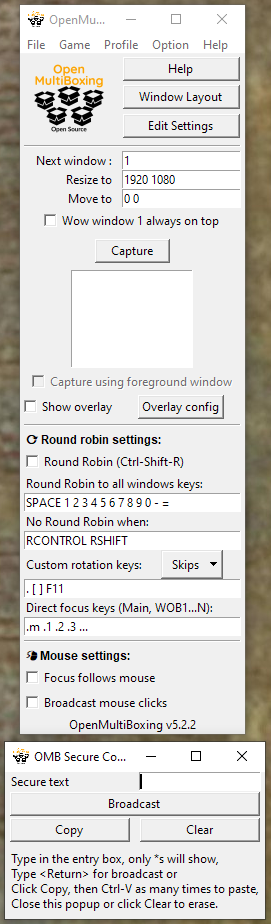

# OpenMultiBoxing (Open Source, safe, Multiboxing)

This is an extension of the project started for World of Warcraft multiboxing ([WowOpenBox](https://WowOpenBox.org/)) but that applies to any kind of Windows game or app, including browser games.

See the [installation](https://github.com/OpenMultiBoxing/OpenMultiBoxing#installation) and instructions and check the Game menu and "Capture foreground window" option.

Use the Game menu to select your Game and/or check the Capture using foreground window:

You can then use the (configurable) hotkey `Ctrl-Shift-C` to capture whichever window you want.
After which your game name should be recorded in the Game menu and you can stick to normal Auto Capture (Options Menu).

OpenMultiboxing is known to work with:

- Blizzard Games (World of Warcraft, ...)
- EVE online
- Path of Exile
- Star Wars&trade;: The Old Republic&trade;
- Mir4
- Browser Games
- And pretty much any Windows 10 application...

And more... try and report your experience so we can add to this list!

Questions, suggestions, come on our 

This version, unlike the WowOpenBox one which doesn't have any broadcasting capability, does

Currently it can **broadcast** any text/string (like your login password) and left mouse clicks.
