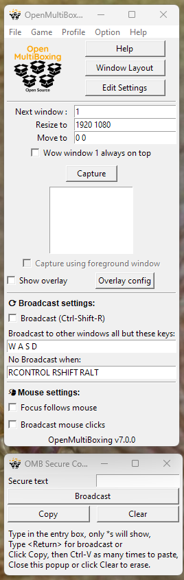

# OpenMultiBoxing (Open Source, safe, Multiboxing)

This is an extension of the project started for World of Warcraft multiboxing ([WowOpenBox](https://WowOpenBox.org/)) but that applies to any kind of Windows game or app, including browser games.

See the [installation](https://github.com/OpenMultiBoxing/OpenMultiBoxing#installation) and instructions and check the Game menu and "Capture foreground window" option.

Use the Game menu to select your Game and/or check the Capture using foreground window:

You can then use the (configurable) hotkey `Ctrl-Shift-C` to capture whichever window you want.
After which your game name should be recorded in the Game menu and you can stick to normal Auto Capture (Options Menu).

OpenMultiboxing is known to work with:

- Blizzard Games (World of Warcraft, ...)
- EVE online
- Path of Exile
- Star Wars&trade;: The Old Republic&trade;
- Mir4
- Browser Games (RoundRobin OMB before 7.0 only)
- And pretty much any Windows 10 or 11 application...

And more... try and report your experience so we can add to this list!

Questions, suggestions, come on our 

This version, unlike the WowOpenBox one which doesn't have any broadcasting capability, does:

Since version 7, OMB can **broadcast** any keys, any text/string (like your login password or a /command) as well left or right mouse clicks.

It can also do broadcasting across multiple PC connections since version 7.2.

Recap of the main features:

- Window Layout wizard and manual tweaking; get your game windows exactly how you want them to be to play.
- Instant swapping of windows; with keyboard hotkeys for fast switching to the next or any specific window.
- Left and right **mouse click broadcasting** option (press W or both buttons or hold them for more than half a second (delay configurable in settings) to avoid broadcasting)
   - For applications that do not support mouse events through PostMessage, uncheck "Mouse broadcast: message mode" in the Options menu.
- **Key broadcasting** when turned on, with exclusions (e.g W A S D for movement from main window)
   - Some applications/games do not accept PostMessage as a way to get input keys and you need to use OMB 5.2.7 with RoundRobin instead.
- **Multi-PC** broadcasting: Select "Listen for other OMB connections" in the options menu on the main computer. Select "Connect to..." in the File menu on the other computers, type the main computer's name. On the main computer, accept the connection request from the other computers.
   - A special case on remote PCs is if you set number of windows to 1 or 0, keyboard events are sent to the system instead of a message queue for each window. Likewise if set to 0 windows, mouse events are scaled to the smallest monitor instead of the non existent window (equivalent of full screen capture of window 1 and non message mode setting).
   - You also have the Option to send mouse movements also to remote PCs.
- Secure text (password) broadcasting option (can also broadcast slash commands, etc)
- Many additional options to switch which window your keys are going to:
  - Swap windows with hotkeys.
  - Focus follow mouse: turns on/off the Windows&trade; accessibility feature so you just hover a window to make it receive keys (note that mouse click broadcast only works if focus follow mouse is off, which )
  - Focus next/previous/specific windows with hotkeys.
- Free, OpenSource and the Safest option available.
- Online [help](https://OpenMultiBoxing.org/help), menus and tooltips on most UI element to help discovering features.

Note: key broadcasting replaces round robin in the latest version of OpenMultiBoxing (WowOpenBox still only has optional Round Robin and no possibility of broadcasting, per Blizzard's multiboxing changes). Use version 6 or below if you prefer to use RoundRobin instead of broadcasting.

(Some help text might still refer in places to `Round Robin`, which is still available for WowOpenBox (and OMB before 7.0) but is recently replaced by `Broadcasting` in OpenMultiBoxing)
